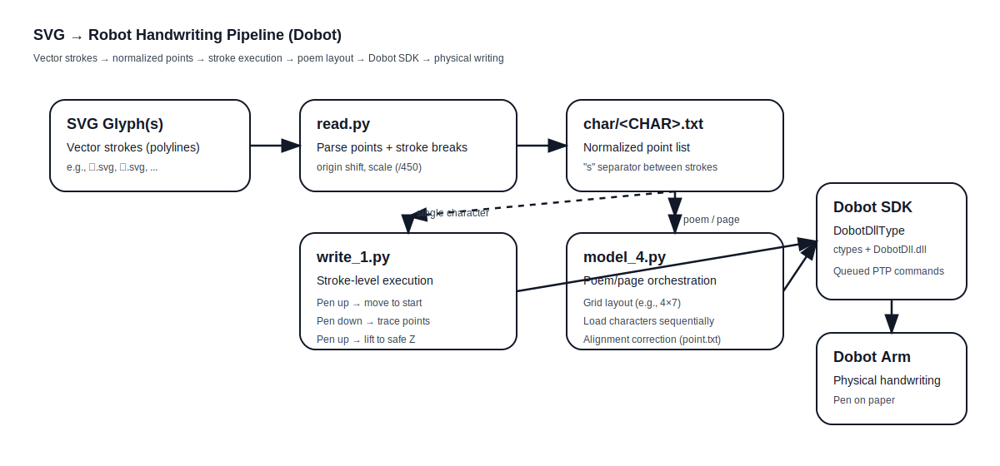

# Robotic Handwriting via SVG-to-Motion Pipeline (Dobot)
An end-to-end robotic handwriting system that converts SVG vector strokes into physical brushstrokes via computer vision, geometric path planning, and real-world robot control.
## Overview
This project implements an end-to-end robotic handwriting system that enables a Dobot robotic arm to write characters and full poems by converting SVG vector strokes into physical pen motions.<br>
The system bridges computer graphics, geometric path planning, and real-world robot control, transforming abstract vector representations into precise, repeatable handwriting on paper.
## Key Features
* ✍️ SVG-based character input (vector strokes)
* 🔁 Stroke-preserving path extraction and normalization
* 🖊 Pen-up / pen-down modeling via Z-axis control
* 🧩 Hierarchical control: stroke → character → poem
* 🧭 Deterministic queued motion execution
* 📐 Human-robot interaction of alignment correction for real-world paper handling
## System Pipeline

```mermaid
flowchart TD
  A[SVG Character Files<br/>(vector strokes)] --> B[read.py<br/>Parse polylines + extract points]
  B --> C[Normalize + scale coordinates<br/>(origin shift, /450)]
  C --> D[Stroke TXT Files<br/>char/&lt;CHAR&gt;.txt<br/>x y lines + "s" stroke separators]

  D --> E[write_1.py<br/>Stroke-level execution]
  E --> E1[Pen up: move to stroke start]
  E1 --> E2[Pen down: lower to writing depth]
  E2 --> E3[Trace points at constant Z]
  E3 --> E4[Pen up: raise to safe Z]

  D --> F[model_4.py<br/>Poem/page-level orchestration]
  F --> F1[Grid layout (e.g., 4×7)]
  F1 --> F2[Load each character's TXT]
  F2 --> F3[Execute strokes sequentially]
  F3 --> F4[Manual paper alignment + correction<br/>(point.txt → dy)]

  E4 --> G[Dobot SDK Layer<br/>(DobotDllType + DobotDll.dll)]
  F4 --> G
  G --> H[Dobot Robot Arm<br/>Physical handwriting on paper]
```

